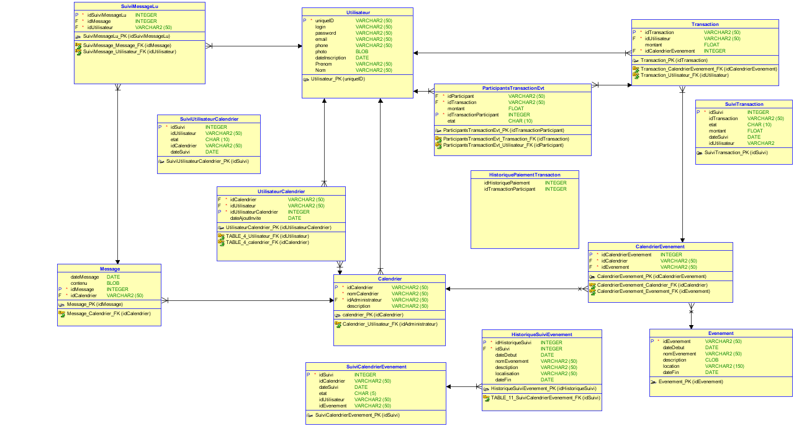

# projetCalendrier
C'est le repository de notre projet du second trimestre

# Alors pour le tuto des bg's que vous êtes 
# s'assurer d'avoir : 
Python version 3

# Créaton d'un environnement virtuelle
py -3 -m venv venv
# Activation de l'environnement virtuelle
venv\Scripts\activate

# Installation de flask
pip install Flask

# [IMPORTANT] Installer deux packages pour faire fonctionner le projet : 
pip install -U flask-cors

pip install cx_oracle

# Installer un client oracle pour faire fonctionner le package cx_Oracle

https://www.oracle.com/fr/database/technologies/instant-client/downloads.html

Copier le dossier à la racine ou python est installé sur l'ordinateur

# Ajouter une variable d'environnement pour que le client oracle soit reconnu 

Ajouter à la suite de la variable d'environnement PATH : %PYTHON_HOME%\ [LE NOM DU DOSSIER DU CLIENT ORACLE]

# Voilà flask est installé, réalisons un petit script désormais
# Le fameux hello world dans un fichier nommé hello.py
from flask import Flask
app = Flask(__name__)

@app.route('/')
def hello_world():
    return 'Hello, World!'

# On export la variable FLASK_APP pour pouvoir lancer le script
set FLASK_APP=hello.py
# On peut alors lancer le serveur
python -m flask run

OU

python -m flask run -h [ADRESSE IP] -p [PORT]
